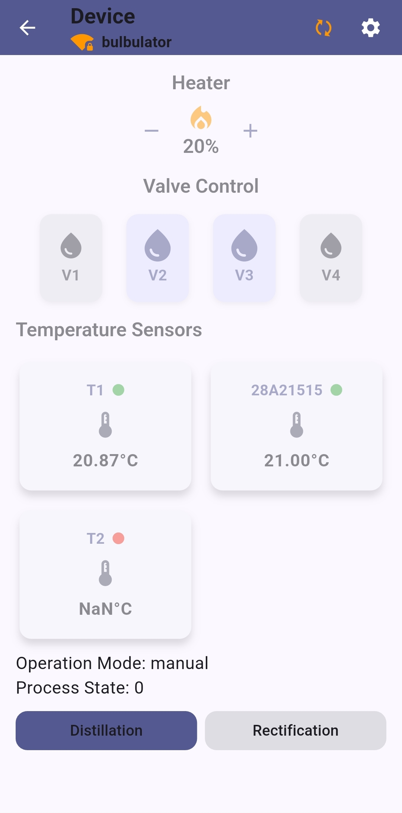
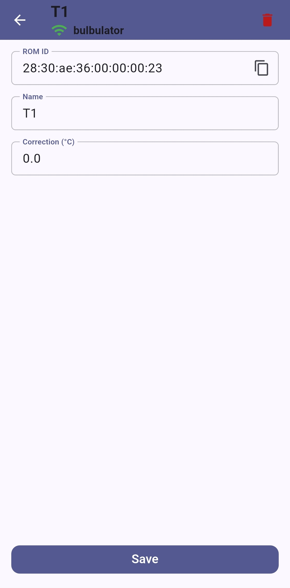

## ThermoFlow

**ThermoFlow** — full-stack asynchronous control system for **ESP32**, implemented in **modern C++23**  
directly on **ESP-IDF**. Instead of the typical C/FreeRTOS task-based design, it defines a **structured C++  
runtime** based on **espressif/asio 1.32.0** (a port of **Boost.Asio**) and **strand-serialized event
execution**.

FreeRTOS and C APIs are encapsulated deep in the system, so high-level development happens entirely in  
clean, idiomatic C++ — modular, testable, and predictable. No direct RTOS tasks, no opaque callbacks —  
just **deterministic async logic** under full control of the architecture.

The firmware manages a complete distillation process: **temperature sensors**, **heater power (PWM)**,  
**valve sequencing**, and **safety logic**, all coordinated through asynchronous message passing on Asio  
strands. Networking uses a **binary TCP protocol** (with optional **TLS via mbedTLS**) supporting multiple  
concurrent sessions. A cross-platform **Flutter client** provides real-time monitoring and control.  
A **SIL framework** mirrors firmware behavior on Linux, enabling development and debugging without  
physical hardware.


## Key Highlights

- **Modern C++23 async architecture**, running directly on ESP-IDF without exposing any C or RTOS APIs
- **Strand-based deterministic execution model** — predictable async flow with zero hidden threading
- **Encapsulated FreeRTOS layer** with idiomatic C++ abstractions, portable and testable on Linux (SIL)
- **Memory-efficient binary protocol**: each frame starts with a 2-byte length, followed by  
  a body containing one or more typed messages. Messages consist of simple types  
  (numbers, strings, arrays), serialized directly by the user code and wrapped into a  
  frame without extra copies. Incoming buffers are minimal on start and grow dynamically  
  as needed — e.g., streaming a 1.5 MB OTA firmware in multiple frames efficiently.
- **Zero-copy streaming design** — adaptive buffer that grows dynamically during heavy transfers (e.g. OTA)
- **Modular system architecture**:
    - `Session / SessionManager` — TCP/TLS session handling, connection lifecycle, dispatch
    - `IO layer` — Temperature, Level, Valve, Heater managers, each async-safe and strand-serialized
    - `Control` — process coordination, configurable distillation parameters
    - `Safety` — future extension for fault detection and emergency shutdown logic
- **Shared 1-Wire bus for temperature sensors** — all DS18B20 sensors operate on the same line,  
  so physical port position does not matter. The system automatically scans the bus,  
  stores discovered sensors in NVS, and allows per-sensor configuration (name, calibration, etc.)
- **SIL framework** mirrors firmware on Linux: mocks ESP-IDF drivers, DS18B20, GPIO, NVS, OTA, and mbedTLS
- **Flutter UI client** for live temperature graphs, valve states, and interactive control
- **Architecture scales efficiently across available cores** without requiring code changes
- **Asio-inspired runtime** built on `espressif/asio 1.32.0` (Boost.Asio 1.30.2 port), fully strand-driven

## Architecture & Life Cycle

The system is structured around a flexible asynchronous event-driven architecture.  
Each component receives an executor (`asio::any_io_executor`) and operates within the
event loop it was assigned, allowing **deterministic, strand-serialized behavior when needed**  
but preserving full flexibility across the system.

1. **Startup**
    - `Application` initializes all modules: `TcpListener`, `SessionManager`,  
      `MessageDispatcher`, IO components (`TemperatureSensorManager`, `ValveManager`,  
      `Heater`, `LedIndicator`) and service modules (`OtaUpdater`, `SettingsManager`).
    - Executors are assigned per component based on system design; no hardwired threads or strands.

2. **Sessions & Networking**
    - `TcpListener` accepts incoming connections → creates `Session` (`SessionPlain` or `SessionTls`).
    - `Session` passes received frames → `MessageDispatcher`.
    - `MessageDispatcher` routes messages to the appropriate handler for the session  
      or forwards events to `Application`.

3. **Event Propagation**
    - `Notifier` mechanism (`subscribe` / `notify`) ensures asynchronous event propagation.
    - IO modules push events through `Notifier`.
    - Subscribed components receive notifications asynchronously via the assigned executor.

4. **Control & Safety**
    - Configurable parameters for Control and Safety are stored in `SettingsManager`  
      and applied in the control loop.
    - All events flow asynchronously via Dispatcher → Application → relevant modules.

5. **Flutter UI / External Client**
    - UI receives live updates over TCP/TLS sessions.
    - Commands from the client are routed Dispatcher → Session → targeted module (Control,  
      Settings, OTA).

6. **SIL (Software-in-the-Loop)**
    - Mocks and fixtures (`fixtures/`, `mocks/`) emulate hardware modules on Linux.
    - Life cycle is identical to the real device; Dispatcher and Notifier behave the same,  
      allowing full async logic testing without hardware.

### Data Flow Diagram

```text
+----------------+
|  Flutter UI    |
+-------+--------+
|
TCP/TLS Session
|
+-------v--------+
|    Session     |
+-------+--------+
|
+-------v--------+
| MessageDispatcher |
+---+---+---+---+---+
|   |   |   |
|   |   |   |
+--v--+ +--v--+ +--v--+ +--v--+
| IO  | |Control| |Safety| |OTA |
+--+--+ +------+ +------+ +----+
|
+------v------+
|  Hardware   |
+-------------+
```

## UI Walkthrough

ThermoFlow Flutter client provides a clean, asynchronous interface for discovering,  
pairing, and controlling devices over the local network. Below — a typical first-run flow.

### 1. Main Screen

  
*Main screen on first launch — no devices yet. Tap **+** to start discovery via mDNS.  
Each device actively broadcasts its presence (`MdnsService`) with hostname and service,  
so the app discovers devices reliably and displays them instantly.*

### 2. Device Discovery


*The app scans the local network for ThermoFlow devices broadcasting via mDNS.  
Discovered devices appear with their name and IP address, ready for instant pairing.*

### 3. Pairing


*Tap a device to pair instantly. After pairing, the app returns to the main screen —  
the newly paired device appears in the list and connects automatically.  
The device list is stored persistently on the client (smartphone or desktop),  
so paired devices remain available after app restart.*

### 5. Device Details

  
*After tapping a device from the list, the app navigates to its **Device Details** screen.  
The header shows the device name and connection status. A toggle allows automatic reconnection  
if the session is lost.*

The screen displays:
- **Heater state**
- **Fixed list of 4 valves**
- **Dynamic list of up to 4 DS18B20 sensors** (limited by the enclosure, not the device)
- **Operating mode** of the device

A button leads to the **Device Settings** screen.

#### Device Control — Example Changes


*Change heater power and update valve states. Shows live sensor statuses, including offline detection.*

#### Auto-reconnect Attempt


*Client detects a lost session and attempts automatic reconnection.*

#### Auto-reconnect in Progress


*Device remains offline; reconnection attempts continue at the configured interval.*

#### No Auto-reconnect


*Automatic reconnect disabled; client remains disconnected and does not try to reconnect.*

#### Sensor Settings


*Tapping a DS18B20 sensor tile navigates to its **Sensor Settings** screen, also accessible  
from the Device Settings menu.*

The screen displays:

- **ROM ID** (read-only)
- **Name** (read/write)
- **Temperature offset** (read/write)

Changes to name or offset are saved directly to the device.

### 6. Settings Screens

#### General Settings

  
*Configure device name, operation mode (AP, STA, or STA+AP), restart the device, or trigger an OTA firmware update.*

#### Device Info

  
*View device status: firmware version, uptime, memory usage, CPU load, and connection state.*

#### Sensor Settings


*Configure individual temperature sensors: name, calibration offset, and ROM ID.*

#### Distillation Configuration


*Set parameters for the distillation process, including operating modes, thresholds, and automation options.*
